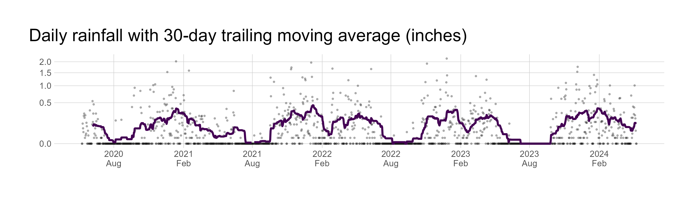
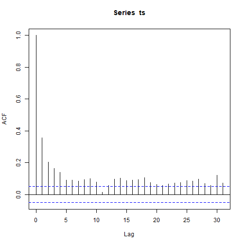
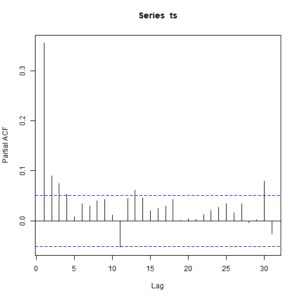
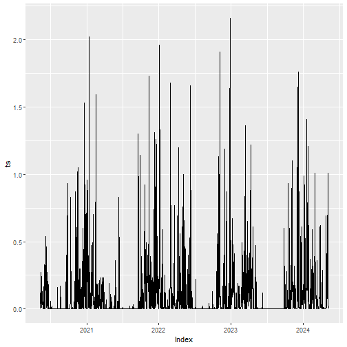
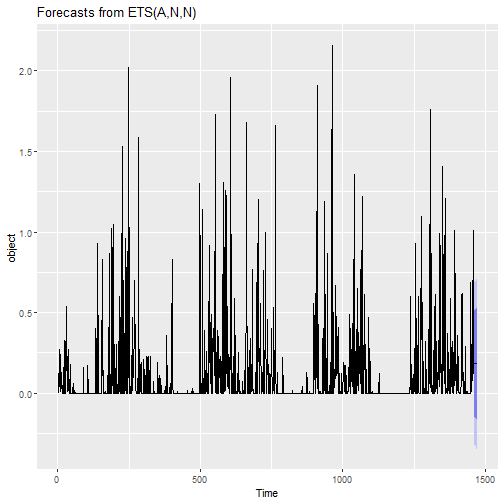
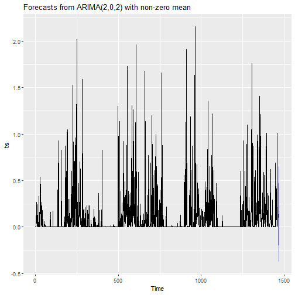

# Rainfall analysis

Rainfall analysis inspired by https://github.com/engjen/rain_pdx


---


Load packages


```r
library(magrittr)
library(tidyverse)
```

```
## ── Attaching core tidyverse packages ──────────────────────────────────────────────────────────────────────────────────────────────────────────────────────────────────────────────────────── tidyverse 2.0.0 ──
## ✔ dplyr     1.1.4     ✔ readr     2.1.5
## ✔ forcats   1.0.0     ✔ stringr   1.5.1
## ✔ ggplot2   3.5.1     ✔ tibble    3.2.1
## ✔ lubridate 1.9.3     ✔ tidyr     1.3.1
## ✔ purrr     1.0.2     
## ── Conflicts ────────────────────────────────────────────────────────────────────────────────────────────────────────────────────────────────────────────────────────────────────────── tidyverse_conflicts() ──
## ✖ tidyr::extract()   masks magrittr::extract()
## ✖ dplyr::filter()    masks stats::filter()
## ✖ dplyr::lag()       masks stats::lag()
## ✖ purrr::set_names() masks magrittr::set_names()
## ℹ Use the conflicted package (<http://conflicted.r-lib.org/>) to force all conflicts to become errors
```

```r
library(ggthemes)
library(hrbrthemes)
library(xts)
```

```
## Loading required package: zoo
## 
## Attaching package: 'zoo'
## 
## The following objects are masked from 'package:base':
## 
##     as.Date, as.Date.numeric
## 
## 
## ######################### Warning from 'xts' package ##########################
## #                                                                             #
## # The dplyr lag() function breaks how base R's lag() function is supposed to  #
## # work, which breaks lag(my_xts). Calls to lag(my_xts) that you type or       #
## # source() into this session won't work correctly.                            #
## #                                                                             #
## # Use stats::lag() to make sure you're not using dplyr::lag(), or you can add #
## # conflictRules('dplyr', exclude = 'lag') to your .Rprofile to stop           #
## # dplyr from breaking base R's lag() function.                                #
## #                                                                             #
## # Code in packages is not affected. It's protected by R's namespace mechanism #
## # Set `options(xts.warn_dplyr_breaks_lag = FALSE)` to suppress this warning.  #
## #                                                                             #
## ###############################################################################
## 
## Attaching package: 'xts'
## 
## The following objects are masked from 'package:dplyr':
## 
##     first, last
```

```r
library(forecast)
```

```
## Registered S3 method overwritten by 'quantmod':
##   method            from
##   as.zoo.data.frame zoo
```

Read rain gauge data from City of Portland Bureau of Environmental Services by way of USGS.

> Vernon School Rain Gage - 2044 NE. Killingsworth St.  
>  
> PROVISIONAL, UNCORRECTED RAW DATA FROM THE CITY OF PORTLAND HYDRA NETWORK.  
> Data are the number of tips of the rain gage bucket.  
> Each tip is 0.01 inches of rainfall.  
>  [`-`, missing data]  
> Dates and times are PACIFIC STANDARD TIME.  

Assume most recent day is incomplete and exclude.
Convert *tips* to inches.


```r
url <- "https://or.water.usgs.gov/non-usgs/bes/vernon.rain"
f <- tempfile()
download.file(url, f)
colNames <- read_lines(f, skip = 9, n_max = 1) %>% str_trim() %>% str_split("\\s+") %>% unlist()
L <- read_lines(f, skip = 11) %>% str_split("\\s+")
date <- sapply(L, function(x) x[1]) %>% as.Date(format = "%d-%b-%Y")
total <- sapply(L, function(x) x[2]) %>% as.numeric()
```

```
## Warning in sapply(L, function(x) x[2]) %>% as.numeric(): NAs introduced by
## coercion
```

```r
hourly <-
  sapply(L, function(x) x[3:26], simplify = FALSE) %>%
  do.call(rbind, .) %>%
  data.frame() %>%
  mutate_if(is.character, as.numeric)
```

```
## Warning: There were 24 warnings in `mutate()`.
## The first warning was:
## ℹ In argument: `X1 = .Primitive("as.double")(X1)`.
## Caused by warning:
## ! NAs introduced by coercion
## ℹ Run `dplyr::last_dplyr_warnings()` to see the 23 remaining warnings.
```

```r
names(hourly) <- paste0("x", colNames[3:26])
df <-
  tibble(date, hourly) %>%
  filter(date < max(date)) %>%
  pivot_longer(starts_with("x")) %>%
  mutate(hour = gsub("x", "", name) %>% as.integer()) %>%
  select(-name) %>%
  mutate(datetime = sprintf("%02d:00", hour) %>% paste(date, .) %>% as.POSIXlt(format = "%Y-%m-%d %H:%M")) %>%
  mutate(inches = value * 0.01) %>%
  select(-value)
head(df) %>% knitr::kable()
```


|date       | hour|datetime            | inches|
|:----------|----:|:-------------------|------:|
|2024-05-09 |    0|2024-05-09 00:00:00 |      0|
|2024-05-09 |    1|2024-05-09 01:00:00 |      0|
|2024-05-09 |    2|2024-05-09 02:00:00 |      0|
|2024-05-09 |    3|2024-05-09 03:00:00 |      0|
|2024-05-09 |    4|2024-05-09 04:00:00 |      0|
|2024-05-09 |    5|2024-05-09 05:00:00 |      0|

## Monthly comparison

Plot the most recent $k$ years.
Assume current month is incomplete and exclude.


```r
k <- 4
currentYear <- year(max(date))
minYear <- currentYear - k
previousMonth <- month(today() %>% floor_date(unit = "month") - 1)
spin <- -((previousMonth - 1/2) / 12) * (2 * pi)
G <-
  df %>%
  filter(max(date) - k * 365.25 <= date) %>%
  filter(!(year(date) == year(today()) & month(date) == month(today()))) %>%
  mutate(year = year(date) %>% factor(),
         isCurrentYear = (year(date) == currentYear),
         monthday = sprintf("%d-%d-%d", currentYear, month(date), day(date)) %>% as.Date()) %>%
  mutate(unit = floor_date(monthday, unit = "month")) %>%
  group_by(year, isCurrentYear, unit) %>%
  summarize(inches = sum(inches, na.rm = TRUE)) %>%
  ungroup() %>%
  ggplot(aes(x = unit, y = inches)) +
    labs(title = "Monthly rainfall (inches)") +
    geom_col(aes(fill = year, alpha = isCurrentYear), position = "dodge", show.legend = c(fill = TRUE, alpha = FALSE)) +
    scale_fill_viridis_d("Year", direction = -1) +
    scale_x_date("", date_breaks = "month", date_labels = "%b", expand = expansion(add = 120 * pi / 180)) +
    scale_y_continuous("", transform = "sqrt") +
    scale_alpha_manual(values = c(2/3, 1)) +
    coord_polar(start = spin) +
    theme_ipsum_ps() +
    theme(panel.grid.minor.x = element_blank(),
          plot.title.position = "plot")
```

```
## `summarise()` has grouped output by 'year', 'isCurrentYear'. You can override
## using the `.groups` argument.
```

```r
ggsave("rainfall.png", dpi = 300, units = "in", height = 5.5, width = 8.5)
```


## Time series analysis

Create `xts` object


```r
daily <-
  df %>%
  filter(max(date) - k * 365.25 <= date) %>%
  mutate(unit = floor_date(date, unit = "day")) %>%
  group_by(unit) %>%
  summarize(n = n(),
            inches = sum(inches, na.rm = TRUE)) %>%
  ungroup() %>%
  filter(n == 24) %>%
  select(unit, inches)
ts <- xts(daily$inches, daily$unit)
```

Do stuff with the time series


```r
lag <- 30
ma <- rollmean(ts, lag, align = "right")
ma <- merge(ts, ma)
ma <- data.frame(daily, ma$ma)
G <-
  ma %>%
  ggplot(aes(x = unit)) +
    labs(title = sprintf("Daily rainfall with %d-day trailing moving average (inches)", lag)) +
    geom_point(aes(y = inches), alpha = 1/4, size = 0.5) +
    geom_line(aes(y = ma), color = viridisLite::viridis(1), linewidth = 1) +
    scale_x_date("", date_breaks = "6 months", date_labels = "%Y\n%b") +
    scale_y_continuous("", transform = "sqrt") +
    theme_ipsum_ps() +
    theme(panel.grid.minor = element_blank(),
          plot.title.position = "plot")
ggsave("rainfallTimeSeries.png", dpi = 300, units = "in", height = 3, width = 10)
```

```
## Warning in transformation$transform(x): NaNs produced
```

```
## Warning in scale_y_continuous("", transform = "sqrt"): sqrt transformation
## introduced infinite values.
```

```
## Warning: Removed 29 rows containing missing values or values outside the scale
## range (`geom_line()`).
```




```r
acf(ts)
```



```r
Box.test(ts)
```

```
## 
## 	Box-Pierce test
## 
## data:  ts
## X-squared = 184.2, df = 1, p-value < 2.2e-16
```

```r
pacf(ts)
```



```r
auto.arima(ts)
```

```
## Series: ts 
## ARIMA(2,0,2) with non-zero mean 
## 
## Coefficients:
##          ar1      ar2      ma1    ma2    mean
##       1.4078  -0.4182  -1.1113  0.153  0.1210
## s.e.  0.1025   0.0998   0.1107  0.101  0.0252
## 
## sigma^2 = 0.06106:  log likelihood = -28.33
## AIC=68.66   AICc=68.71   BIC=100.38
```

```r
autoplot(ts)
```



```r
forecast <- forecast(ts)
autoplot(forecast)
```



```r
m <- auto.arima(ts)
forecast <- forecast(m)
autoplot(forecast)
```




---


Session information


```r
sessionInfo()
```

```
## R version 4.4.0 (2024-04-24 ucrt)
## Platform: x86_64-w64-mingw32/x64
## Running under: Windows 10 x64 (build 19044)
## 
## Matrix products: default
## 
## 
## locale:
## [1] LC_COLLATE=English_United States.utf8 
## [2] LC_CTYPE=English_United States.utf8   
## [3] LC_MONETARY=English_United States.utf8
## [4] LC_NUMERIC=C                          
## [5] LC_TIME=English_United States.utf8    
## 
## time zone: America/Los_Angeles
## tzcode source: internal
## 
## attached base packages:
## [1] stats     graphics  grDevices utils     datasets  methods   base     
## 
## other attached packages:
##  [1] forecast_8.22.0  xts_0.13.2       zoo_1.8-12       hrbrthemes_0.8.7
##  [5] ggthemes_5.1.0   lubridate_1.9.3  forcats_1.0.0    stringr_1.5.1   
##  [9] dplyr_1.1.4      purrr_1.0.2      readr_2.1.5      tidyr_1.3.1     
## [13] tibble_3.2.1     ggplot2_3.5.1    tidyverse_2.0.0  magrittr_2.0.3  
## 
## loaded via a namespace (and not attached):
##  [1] gtable_0.3.5            xfun_0.43               lattice_0.22-6         
##  [4] tzdb_0.4.0              quadprog_1.5-8          vctrs_0.6.5            
##  [7] tools_4.4.0             generics_0.1.3          curl_5.2.1             
## [10] parallel_4.4.0          fansi_1.0.6             highr_0.10             
## [13] pkgconfig_2.0.3         lifecycle_1.0.4         farver_2.1.1           
## [16] compiler_4.4.0          textshaping_0.3.7       munsell_0.5.1          
## [19] httpuv_1.6.15           fontquiver_0.2.1        fontLiberation_0.1.0   
## [22] htmltools_0.5.8.1       Rttf2pt1_1.3.12         pillar_1.9.0           
## [25] later_1.3.2             crayon_1.5.2            extrafontdb_1.0        
## [28] gfonts_0.2.0            nlme_3.1-164            mime_0.12              
## [31] fontBitstreamVera_0.1.1 fracdiff_1.5-3          tidyselect_1.2.1       
## [34] digest_0.6.35           stringi_1.8.3           labeling_0.4.3         
## [37] tseries_0.10-55         extrafont_0.19          fastmap_1.1.1          
## [40] grid_4.4.0              colorspace_2.1-0        cli_3.6.2              
## [43] crul_1.4.2              utf8_1.2.4              withr_3.0.0            
## [46] gdtools_0.3.7           scales_1.3.0            promises_1.3.0         
## [49] bit64_4.0.5             timechange_0.3.0        TTR_0.24.4             
## [52] bit_4.0.5               quantmod_0.4.26         nnet_7.3-19            
## [55] timeDate_4032.109       ragg_1.3.0              hms_1.1.3              
## [58] urca_1.3-3              shiny_1.8.1.1           evaluate_0.23          
## [61] knitr_1.46              lmtest_0.9-40           viridisLite_0.4.2      
## [64] rlang_1.1.3             Rcpp_1.0.12             xtable_1.8-4           
## [67] glue_1.7.0              httpcode_0.3.0          vroom_1.6.5            
## [70] jsonlite_1.8.8          R6_2.5.1                systemfonts_1.0.6
```
